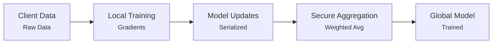

# CryptaLearn Architecture

## Overview
CryptaLearn is a privacy-preserving machine learning library written in OCaml, implementing three core privacy technologies: Federated Learning (FL), Homomorphic Encryption (HE), and Differential Privacy (DP).

## Core Modules

### 1. Federated Learning (`lib/fl/`)
**Purpose:** Enable decentralized model training without sharing raw data.

**Key Components:**
- Neural network implementation with multiple activation functions
- Mini-batch training with SGD
- Model serialization and versioning
- Secure aggregation with integrity checks
- Weighted model averaging

**Public API:** (from `fl.mli`)
- `create_model : int array -> model`
- `train_client : model -> client_data -> training_config -> client_update`
- `aggregate_updates : client_update list -> model`
- `evaluate_model : model -> client_data -> float`
- `secure_aggregate : versioned_model list -> float array -> versioned_model`

### 2. Homomorphic Encryption (`lib/he/`)
**Purpose:** Perform computations on encrypted data.

**Key Components:**
- Paillier cryptosystem implementation
- Additive homomorphic operations
- Matrix and vector operations
- Key rotation and management
- Parallel encryption/decryption

**Public API:** (from `he.mli`)
- `generate_keypair : int -> public_key * private_key`
- `encrypt : public_key -> plaintext -> ciphertext`
- `decrypt : public_key -> private_key -> ciphertext -> plaintext`
- `add : public_key -> ciphertext -> ciphertext -> ciphertext`
- `mult : public_key -> ciphertext -> plaintext -> ciphertext`
- `encrypt_matrix : public_key -> float array array -> matrix`
- `parallel_encrypt : public_key -> float array -> ciphertext array`

### 3. Differential Privacy (`lib/dp/`)
**Purpose:** Add privacy-preserving noise to data and computations.

**Key Components:**
- Multiple noise mechanisms (Laplace, Gaussian, Exponential)
- Privacy budget tracking and accounting
- Rényi Differential Privacy (RDP) support
- Local differential privacy mechanisms
- Advanced composition theorems

**Public API:** (from `dp.mli`)
- `create_privacy_params : float -> float -> float -> privacy_params`
- `add_noise : noise_mechanism -> privacy_params -> float -> float`
- `create_accountant : noise_mechanism -> privacy_accountant`
- `compute_privacy_spent : privacy_accountant -> float * float`
- `create_moments_accountant : noise_mechanism -> float array -> moments_accountant`
- `local_dp_mean : float array -> privacy_params -> float`

### 4. Main Library (`lib/cryptalearn.ml`)
**Purpose:** Provide high-level test framework and utilities.

**Key Components:**
- Test configuration management
- Timing and benchmarking utilities
- Helper functions (XOR data generation, matrix comparison)
- Integrated test suite for all three modules
- Error handling and verification

**Public API:**
- `default_config : test_config`
- `run_tests : test_config -> bool`
- `test_federated_learning : test_config -> unit`
- `test_homomorphic_encryption : test_config -> unit`
- `test_differential_privacy : test_config -> unit`

## Data Flow

### Federated Learning Pipeline


### Privacy-Preserving Pipeline (Combined)
```
1. Local Training (FL)
2. Gradient Clipping (DP)
3. Noise Addition (DP)
4. Encryption (HE)
5. Secure Aggregation (FL + HE)
6. Decryption (HE)
7. Global Model Update
```

## Design Patterns

### 1. Module System
- First-class modules for key management (KeyRotation)
- Submodules for organization (CryptaLearn.fl, .he, .dp)
- Interface files (.mli) for clean API boundaries

### 2. Type Safety
- Strong typing for privacy parameters
- Phantom types for versioning
- Record types for configuration

### 3. Functional Programming
- Immutable data structures where possible
- Higher-order functions for flexibility
- Pattern matching for control flow

## Dependencies

### Core Dependencies
- **ocaml** (≥4.14.0) - Language runtime
- **dune** (≥3.17) - Build system
- **core** - Jane Street standard library alternative
- **zarith** - Arbitrary precision integers (for HE)
- **unix** - Unix system calls

### Build Dependencies
- **odoc** - Documentation generation

## Build System

### Dune Configuration
Each module has its own `dune` file specifying:
- Library name and public name
- Dependencies
- Compilation flags

### Build Commands
```bash
dune build              # Build all
dune build @install     # Build installable artifacts
dune exec bin/main.exe  # Run executable
dune clean              # Clean build artifacts
```

## Performance Characteristics

### Federated Learning
- **Time Complexity:** O(n × e × b) where n=samples, e=epochs, b=batch_size
- **Space Complexity:** O(m × w) where m=model_size, w=number_of_weights
- **Bottleneck:** Forward/backward propagation

### Homomorphic Encryption
- **Key Generation:** O(k) where k=key_size
- **Encryption:** O(k) per value
- **Homomorphic Add:** O(1)
- **Homomorphic Mult:** O(k)
- **Bottleneck:** Modular exponentiation

### Differential Privacy
- **Noise Generation:** O(1) per value
- **Privacy Accounting:** O(q) where q=number_of_queries
- **Gradient Clipping:** O(n) where n=gradient_size
- **Bottleneck:** Noise sampling for large datasets

## Security Considerations

### Federated Learning
- Model updates can leak information
- Requires secure aggregation
- Integrity checks prevent poisoning attacks

### Homomorphic Encryption
- Key size determines security level
- 1024-bit: Basic security
- 2048-bit: Recommended for production
- 4096-bit: High security

### Differential Privacy
- ε (epsilon) controls privacy level
  - ε < 0.1: Strong privacy
  - ε = 0.1-1.0: Moderate privacy
  - ε > 1.0: Weak privacy
- δ (delta) should be < 1/n where n=dataset_size

## Extension Points

### Adding New Activation Functions
```ocaml
(* In fl.ml *)
type activation = 
  | ReLU | Sigmoid | Tanh 
  | NewActivation  (* Add here *)

let apply_activation act x = match act with
  | NewActivation -> (* implement *)
  | ...
```

### Adding New Noise Mechanisms
```ocaml
(* In dp.ml *)
type noise_mechanism = 
  | Laplace | Gaussian | Exponential
  | NewMechanism  (* Add here *)
```

### Adding New Privacy Accountants
```ocaml
(* In dp.ml *)
type accountant_type = 
  | Basic | Advanced | Moments
  | NewAccountant  (* Add here *)
```

## Testing Strategy

### Unit Tests (`test/test_CryptaLearn.ml`)
- Module-level testing
- Integration testing
- Property-based testing where applicable

### Integration Tests (`lib/cryptalearn.ml`)
- End-to-end workflows
- Cross-module interactions
- Performance benchmarking

### Test Configuration
```ocaml
type test_config = {
  fl_samples: int;        (* Training samples *)
  key_size: int;          (* HE key size *)
  matrix_size: int;       (* Test matrix dimensions *)
  dp_epsilon: float;      (* Privacy budget *)
  dp_delta: float;        (* Privacy failure probability *)
  verification: bool;     (* Enable checks *)
  seed: int option;       (* Reproducibility *)
}
```

## Future Enhancements

### Planned Features
1. **Secure Multi-Party Computation (SMC)**
2. **Zero-Knowledge Proofs**
3. **Advanced FL algorithms** (FedProx, FedNova)
4. **GPU acceleration** for HE operations
5. **Distributed privacy accounting**

### Optimization Opportunities
1. Parallel FL training across clients
2. Batch HE operations optimization
3. Adaptive DP noise calibration
4. Memory-efficient model serialization

## References

### Academic Papers
- Federated Learning: McMahan et al. (2017)
- Paillier Cryptosystem: Paillier (1999)
- Differential Privacy: Dwork et al. (2006)
- RDP: Mironov (2017)

### Implementation Resources
- OCaml Documentation: https://ocaml.org/docs
- Dune Documentation: https://dune.readthedocs.io
- Jane Street Core: https://opensource.janestreet.com/core/
